Đề tài tập trung phân tích xu hướng mua sắm, phân khúc giá, hành vi khách hàng và nhà bán hàng, đồng thời trực quan hóa dữ liệu bằng biểu đồ và xây dựng giao diện tương tác với Streamlit.
# 📊 BÁO CÁO PHÂN TÍCH VÀ TRỰC QUAN HÓA DỮ LIỆU SHOPEE

Dự án phân tích dữ liệu bán hàng Shopee: xử lý dữ liệu, phân tích phân khúc giá, lượt bán, danh mục, mức giảm giá và đánh giá sản phẩm tiềm năng.

---

## 📁 Dữ liệu & Script Tiền Xử Lý
- **File dữ liệu gốc/đã làm sạch:** `shopee_data_clean.xlsx`
- **Script làm sạch dữ liệu:** `data_clean.py`
- **Script chỉnh sửa dữ liệu:** `edit_data`
- **Script hiển thị dữ liệu dạng bảng:** `hien_thi_bang.py`
---

## 🛠️ Các Module Phân Tích & Biểu Đồ Trực Quan

### 1. Phân khoảng giá & Tổng quan (`module_price_range.py`)
- **Top 10 danh mục nhiều sản phẩm nhất:**
  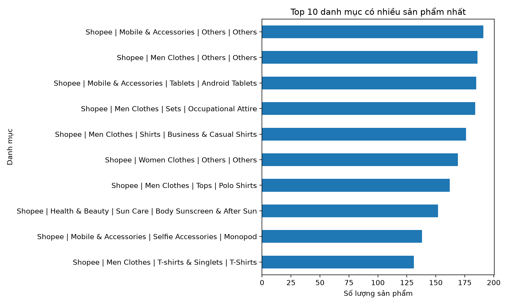
- **Số lượng sản phẩm theo giá:**
  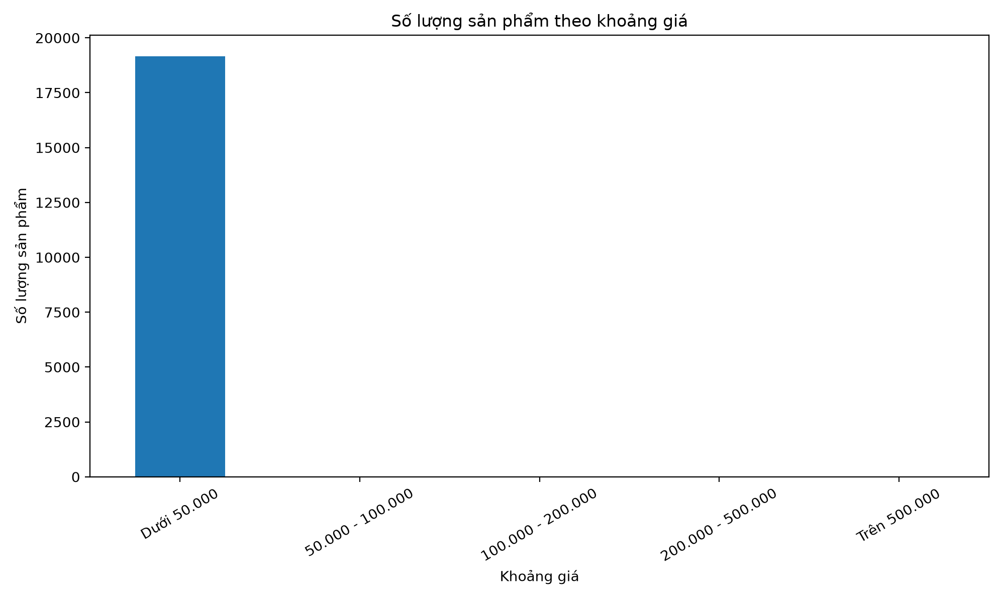
- **Phân bố giá bán thực tế của sản phẩm:**
  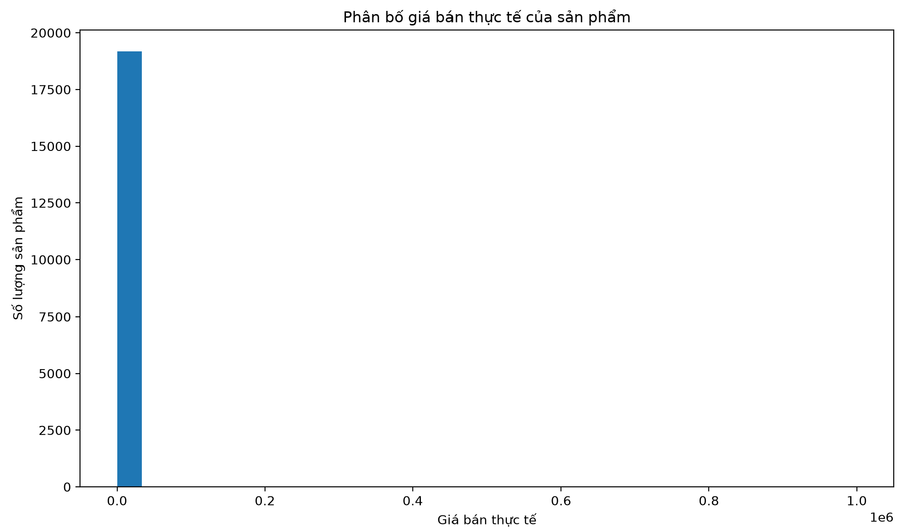
- **Top 10 danh mục có giá trung bình cao:**
  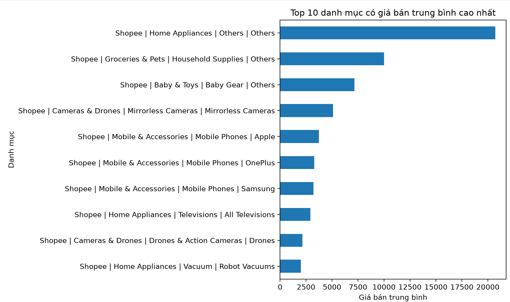
---

### 2. Rating & Lượt bán (`module_rating_sold.py`)
- **Phân phối giá:**
  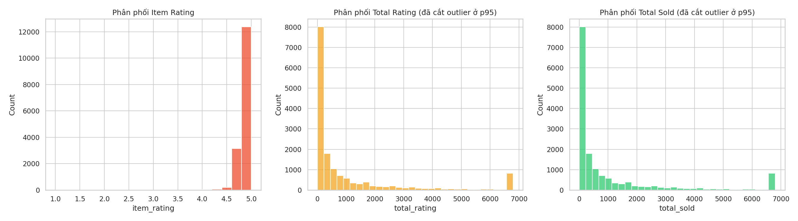
- **Top 10 sản phẩm được đánh giá nhiều nhất:**
  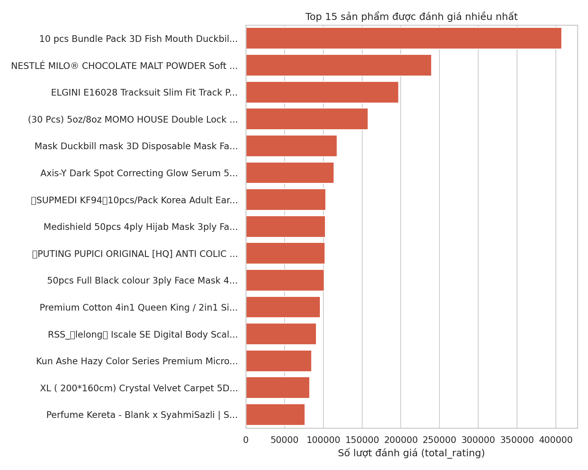
- **Top 15 sản phẩm bán chạy nhất:**
  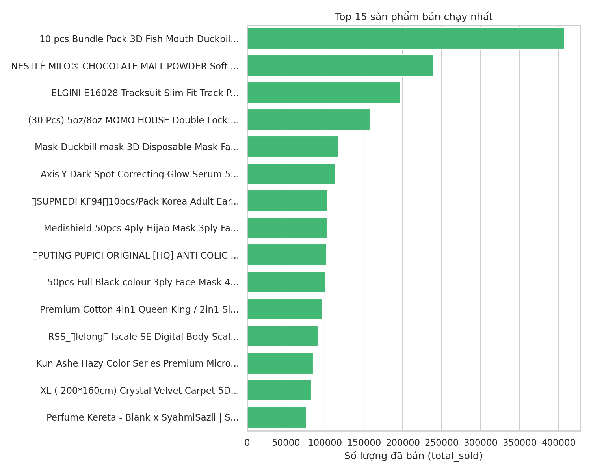
- **Lượt bán và đánh giá:**
  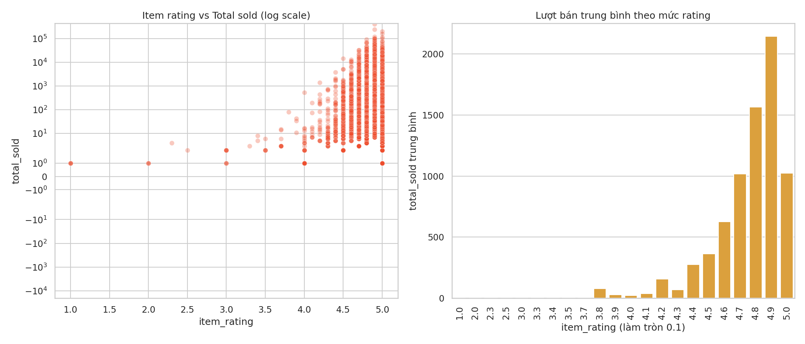

---

### 3. Danh mục chính & Thời gian (`module_category_time.py`)
- **Top 10 Danh mục danh mục:**
  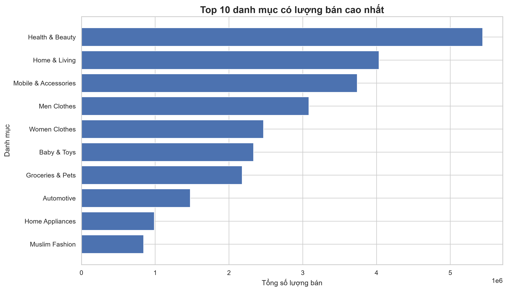
- **Tỷ trọng Top 10 sản phẩm:**
  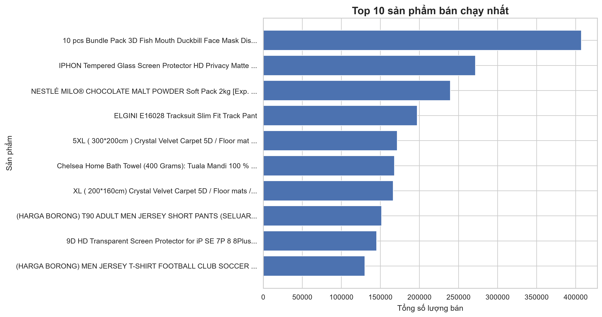
- **Xu hướng lượt bán:**
  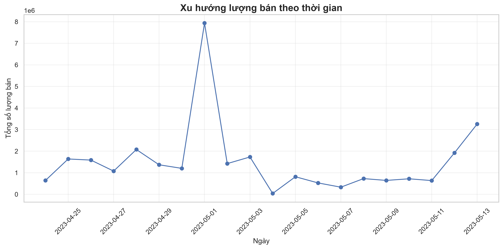
- **Tỷ trọng:**
  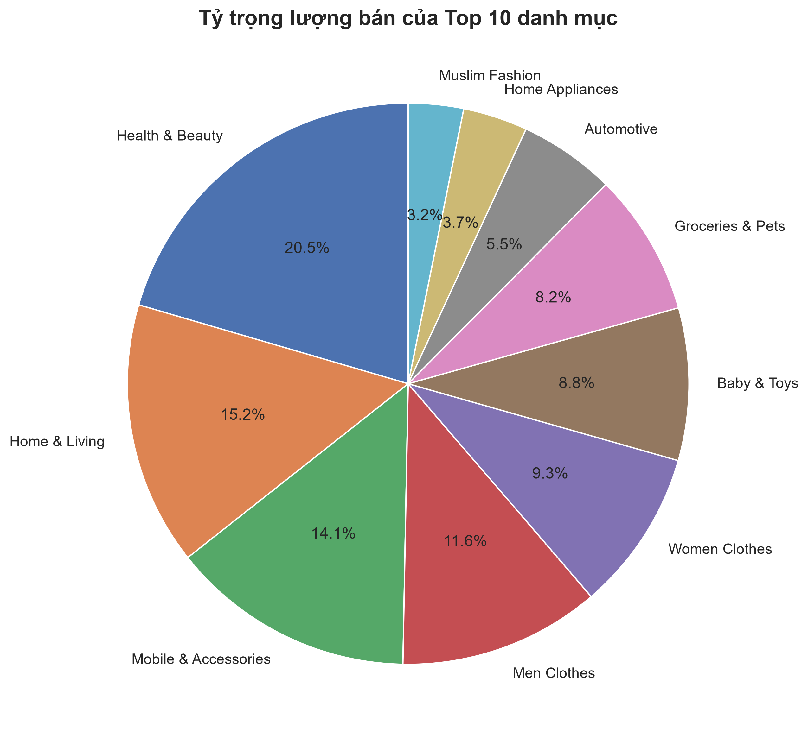
  
---

### 4. Mức giảm giá (%) & Ưu đãi (`module_discount.py`)
- **Ma trận tương quan Giảm giá:**
  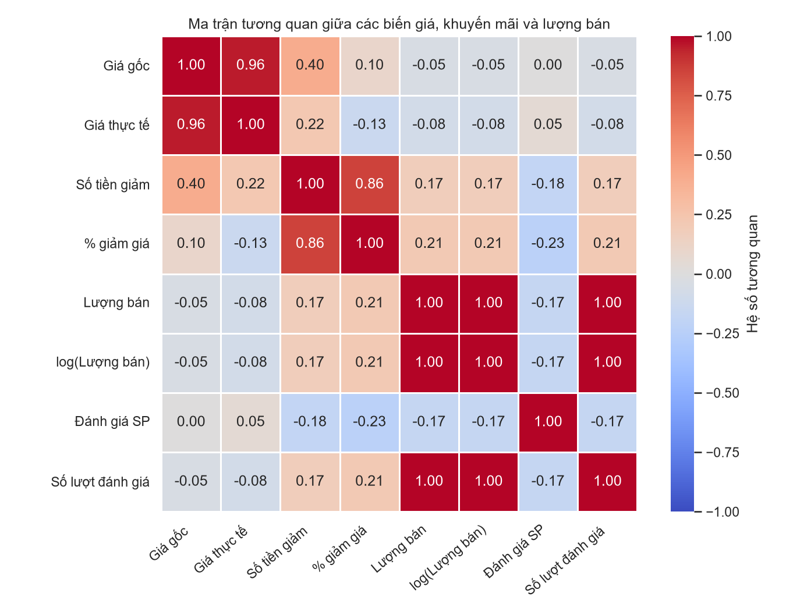
- **Biểu đồ tổng quan Mức giảm giá & Ưu đãi:**
  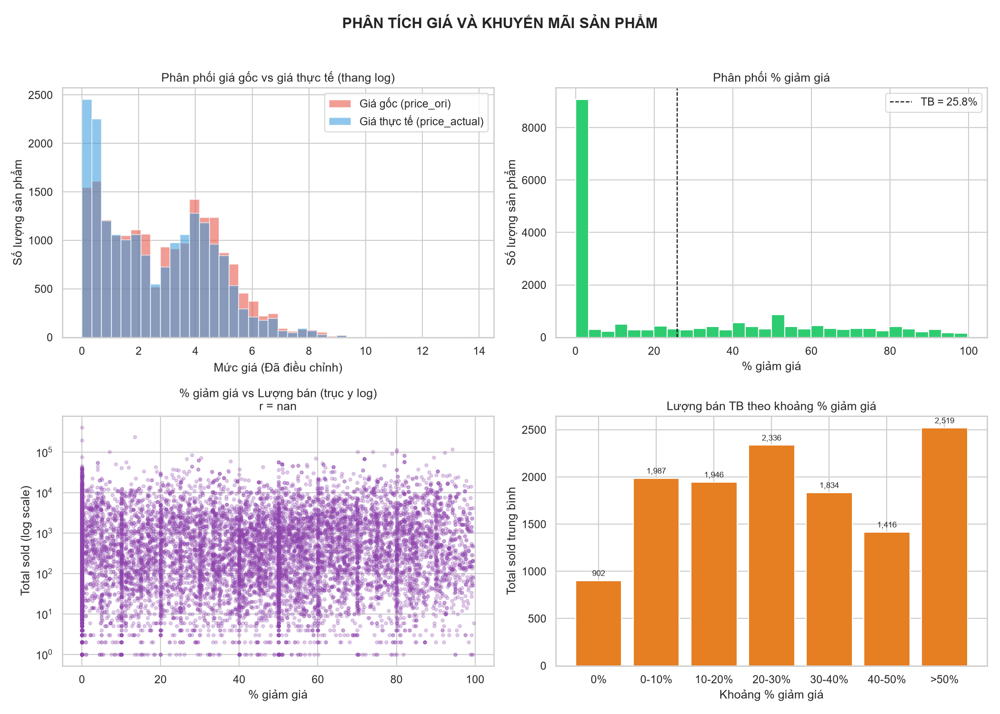

---

### 5. Tổng hợp & Đánh giá Tiềm năng (`module_potential_analysis.py`)
- **Tổng hợp đánh giá sản phẩm tiềm năng:**
  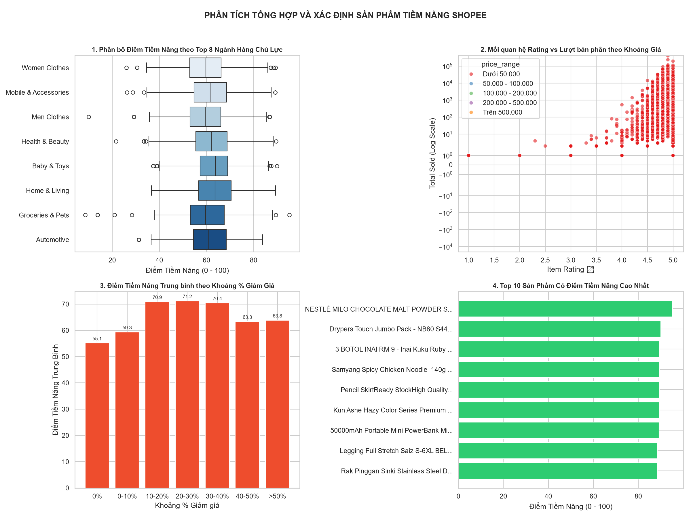
- **Ma trận tương quan tổng thể:**
  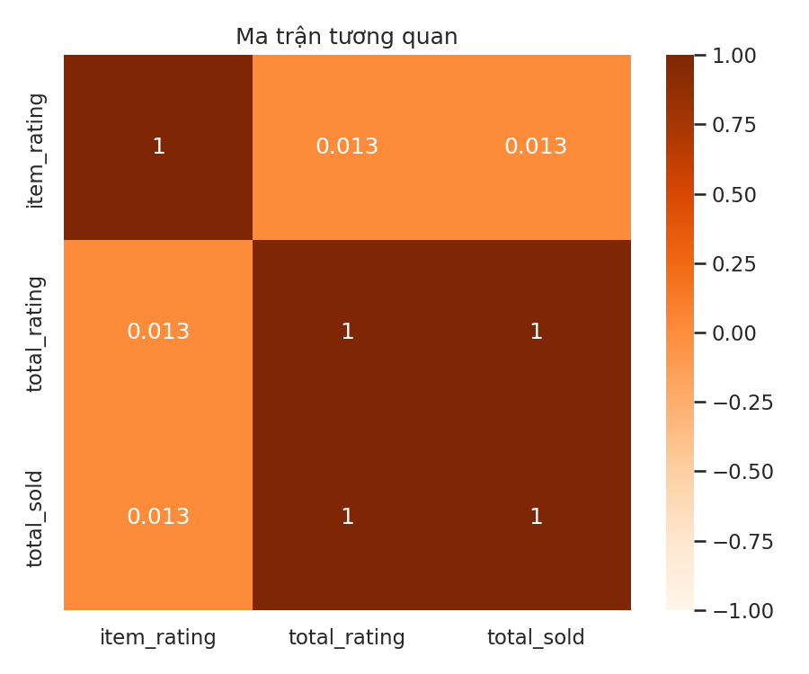
